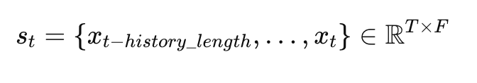
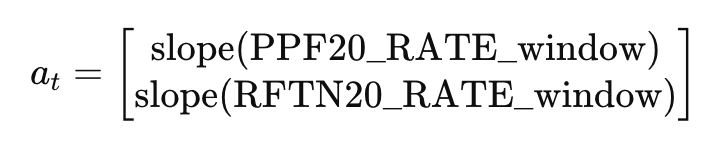
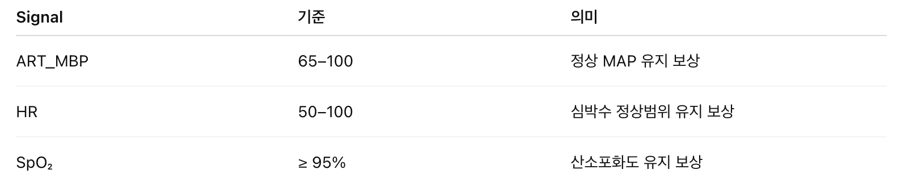
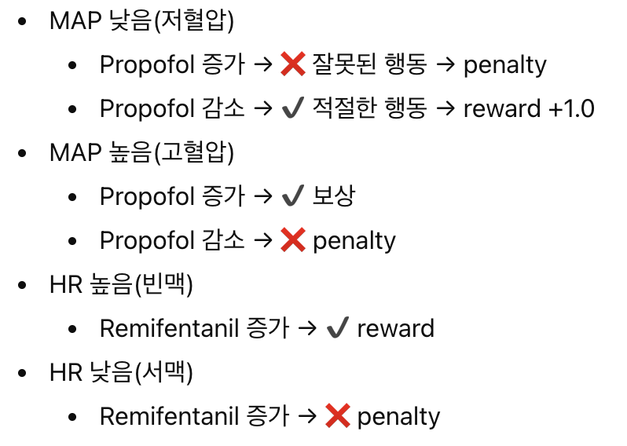
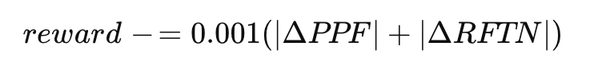
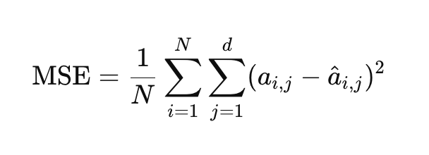
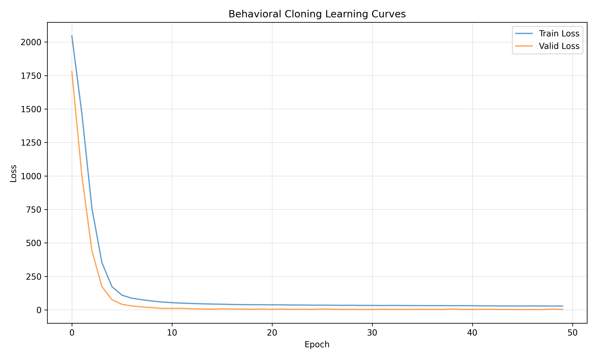
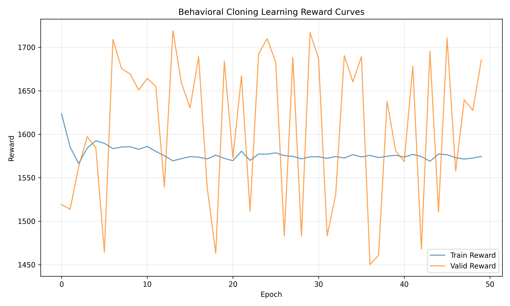

## Usage

* code directory로 들어가준다.
### 1. conda 가상 환경 생성
```bash
  conda env create -f environment.yml
  conda activate RL
  # torch install
  pip3 install torch torchvision --index-url https://download.pytorch.org/whl/cu128
  # or (for cpu)
  pip install torch torchvision
```
### 2. Data 구축
```bash
  python data_download.py --data_dir [DATA_DIREC] --history_length [HISTORY_LENGTH] --seed [SEED]
  # e.g.
  # python data_download.py --data_dir ../dataset --history_length 10 --seed 67
```
--data_dir (default: "./dataset")
* signal_data 디렉토리와 clinical_data.csv가 위치해있는 상위 dataset 디렉토리

--history_length (default: 30)
* 각 subject의 time step의 길이에 관여하는 요소
* 결과 data 길이 = history_length + 1

--seed (default: 67) int
* train & valid set을 나눌 떄 사용되는 seed

### 3. Training
```bash
  python main.py --data_dir [DATA_DIREC] --save_dir [SAVE_DIREC] --history_length [HISTORY_LENGTH] --policy_type [POLICY_TYPE]
  # e.g.
  # python main.py --data_dir ../dataset --save_dir ../results --history_length 10 --policy_type transformer
```
--data_dir (default: "./dataset")
* signal_data 디렉토리가 위치해있는 상위 dataset 디렉토리

--save_dir (default: "./results")
* training 결과들이 저장될 디렉토리

--history_length (default: 30)
* 각 subject의 time step의 길이에 관여하는 요소

--policy_type (default: "transformer")
* Policy Model들 ('lstm', 'mog', 'transformer')

### 4. Pretrained-Model Load
```bash
  python model_load.py --model_direc [MODEL DIREC]
```

--data_dir (required)
* model 정보가 위치해있는 디렉토리

## Pretrained Results Link
* [Google Drive](https://drive.google.com/drive/folders/1mrZ9lBG4S8q9K_01zBXXAVjSnT0U5fAO?usp=sharing)


# 1. 프로젝트 주제 및 목표

## 1-1. 프로젝트 주제
* 수술 중 실시간 생체신호(vital signs)와 마취 약물 투여 로그를 기반으로, 전문 마취과 의사의 약물 조절 행동을 모사(Imitation Learning)하는 정책 모델을 개발한다.
* Transformer 같은 시계열 신경망을 활용하여, Propofol·Remifentanil 등의 약물 조절 패턴을 예측하는 Behavior Cloning 기반 마취 의사결정 지원 모델을 구축한다.
* 본 프로젝트는 수술실 모니터링 환경에서 활용 가능한 의료진 보조 의사결정 시스템을 목표로 하며, 경험이 적은 의료진에게 전문가 수준의 약물 조절 패턴을 제시할 수 있다.

## 1-2. 프로젝트 목표
#### 1. 전문가 행동 정책 학습
* VitalDB 기반 환자 생체신호 + 약물 데이터로부터 전문 의사의 약물 조절(action) 정책 π(a|s)을 Behavior Cloning으로 학습한다.
* 시계열 입력을 활용해 환자의 상태 변화에 따른 약물 조절 전략을 모델링한다.

#### 2. 마취 모니터링 AI 모델 개발
* Transformer, LSTM 등 시계열 딥러닝 모델을 정책 네트워크로 구축하여 특정 환자 상태에서 전문가가 취할 행동을 예측한다.
* 정책 모델의 안정성과 generalization을 보장하는 전처리·정규화 파이프라인을 구축한다.
#### 3. 의료 AI 의사결정 지원 시스템(DSS) 기반 마련
* 경험이 적은 의사에게 약물 조절 가이드라인 제공 (예: 저혈압 시 Propofol 감량, 빈맥 시 Remifentanil 조정 등)
* 수술 중 위험 변화 조기 탐지 및 intervention 제안
* 마취제 자동 조절(Closed-loop anesthesia control)의 핵심 정책 모델로 확장
* RL 기반 마취 시뮬레이터 및 physiology model로 확장 가능
#### 4. 향후 확장 가능성
* 실제 의료기기 또는 모니터링 시스템에 탑재하여 정량적이고 일관된 마취 조절 의사결정 지원 기능 제공 가능.
* 다양한 병원 환경과 환자군으로 Generalization 연구 수행.
# 2. 환경 및 데이터
## 2-1. 환경 및 데이터 설명
* 환경: continuous한 action & state space를 가진 task이다.
* 데이터 설명: ART_MBP, HR등의 생체 신호 시계열 데이터를 사용한다.
  * ART_MBP: Mean Arterial Pressure (평균 동맥압)
  * ART_SBP: Systolic Blood Pressure (수축기 혈압)
  * HR: Heart Rate
  * SPO2: Oxygen Saturation
  * PPF20_RATE / RFTN20_RATE: 현재 Propofol / Remifentanil 주입 속도
  * PPF20_VOL / RFTN20_VOL: 누적 투여량
  위 8개의 continuous signal을 기반으로 state, action, reward가 결정된다.
## 2-2. state
입력
* DataFrame(df): VitalDB에서 로드한 생체신호 및 약물 투여 테이블
* idx: 현재 시점
* history_length: state에 포함할 과거 window 길이 (예: 10)

State 구조



* T = history_length + 1 (예: 11 timestep)
* F = feature 개수 (ART_SBP, ART_MBP, HR, SPO2, PPF20_RATE, RFTN20_RATE, PPF20_VOL, RFTN20_VOL)

## 2-3. action
Action
과거 history_length window의 약물 RATE 값들에 대해 linear regression slope(기울기)를 계산하여 action으로 사용.



action은 “최근 일정 구간 동안 약물 투여율이 증가 경향인지 / 감소 경향인지”를 나타냄.

## 2-4. reward
* State + Predicted Action 기반
* 현재 state를 기준으로 적합하다고 판단되는 range에 각 signal이 들어오면 postive reward를 제공했고, 그렇지 않거나 상황에 맞지 않는 약물 또는 너무 많은 약물을 사용하면 negative reward를 제공한다.
  * 생리학적 안정성 보상 (State-only reward)
  * Predicted Action 상황 적합성 보상
  * 약물 사용량 패널티 (Drug Efficiency Penalty)
  ### 2-4-(1). Reward-생리학적 안정성 보상 (State-only reward)
  아래 표에 있는 범위를 적합성 번위로 간주한다.
  
  ### 2-4-(2) Predicted Action 상황 적합성 보상
  상황 별로 약물 대처에 따른 reward를 부여한다.
  
  ### 2-4-(3) 약물 사용량 패널티 (Drug Efficiency Penalty)
  마지막으로 과도한 약물 사용을 방지하기 위해 penalty를 다음과 같이 준다.
  
# 3. 강화학습 알고리즘 및 hyperparameter 등 설명
## 3-1. 강화학습 알고리즘
* 핵심 알고리즘은 Behavior Cloning(행동 모방학습)이다.
  * 즉, AI가 스스로 보상을 최대화하며 정책을 찾아가는 것이 아니라, 전문의가 실제 상황에서 선택한 행동(action)을 그대로 학습하는 지도학습 방식을 사용한다.

* 특히 본 프로젝트에서는 시계열 의존성이 강한 마취 데이터를 다루기 위해 Transformer 기반 정책 모델(Transformer Policy)을 사용한다.
  * Transformer는 긴 시간 범위의 의존성을 효율적으로 처리하고, LSTM보다 병렬화가 가능해 빠르고 안정적인 학습이 가능하다.
  * 따라서 Behavior Cloning + Transformer Policy 조합은 전문가의 약물 조절 패턴을 세밀하게 재현하며, 향후 임상 보조 시스템으로 발전할 기반 기술을 제공한다.
## 3-2. Hyperparameter 설명
* 본 프로젝트에서는 Transformer를 사용하고 아래와 같은 hyperparameter들을 확인한다.
  * Hidden_dim: Transformer 내부에서 각 토큰(여기서는 시계열의 한 시점)이 표현되는 벡터의 크기이다.
  * Num_heads: Self-Attention을 여러 방향에서 동시에 수행하는 병렬 개수.
  * Num_layers: Transformer Encoder Layer의 반복 횟수

# 4. 실험 Setup
## 4-1. 실험 환경
#### GPU 정보
* NVIDIA GeForce RTX 4090  
* Driver Version: 571.96  
* CUDA Version: 12.8
#### CPU 및 그 외 정보
* 프로세서: Intel(R) Core(TM) i7-14700K(3.40 GHz) & x64 기반 프로세서
* 설치된 RAM: 64.0GB
* 운영체제: Window 11 pro & 64비트

## 4-2. Evaluation Metric
* MSE(Mean Squared Error) Loss를 통해서 학습을 시도했다.
* 또한, Reward는 학습에 참여하지 않지만 성능 추이를 보기 위해서 구현했다.
* 아래 식에서
  * N은 subject의 개수
  * d는 action vector의 길이(이 프로젝트에서는 2이다.)
  

# 5. 실험 결과
## 5-1. Loss & Reward Graph



## 5-2. Results Table
* num_layer를 제외한 다른 hyper parameter를 고정했다.
  * hidden_dim: 128
  * num_heads: 4

| **num_layers** | **Train Loss (mean ± CI)** | **Valid Loss (mean ± CI)** | **Train Reward (mean ± CI)** | **Valid Reward (mean ± CI)** |
| -------------- | -------------------------- | -------------------------- | ---------------------------- | ---------------------------- |
| **1**          | 28.9165 ± 1.0505           | 3.2582 ± 0.7982            | 1606.4214 ± 20.1689          | 1590.5484 ± 91.2558          |
| **2**          | 20.9335 ± 0.3962           | 2.2719 ± 0.6601            | 1598.0141 ± 9.9710           | 1556.6473 ± 107.6755         |
| **3**          | 19.8248 ± 0.7843           | 1.5201 ± 0.3654            | 1593.0500 ± 11.2844          | 1614.1915 ± 78.3355          |

# 6. 토의 및 결과
## 6-1. 실험 결과에 대한 생각.

### Train loss > Valid Loss
* 실험 결과에서 공통적으로 확인되는 특징은 train loss가 valid loss보다 일관적으로 크게 나타난다는 점이다. 일반적인 딥러닝 패턴(훈련셋 → 더 잘 맞추기 때문에 train loss < valid loss)과는 반대의 현상인데, 이는 아래와 같은 이유로 설명할 수 있다.
  * Vital signal의 variance가 높거나 환자 상태 변화가 train set에 더 많이 포함되어 있을 가능성
    → 모델이 더 복잡한 패턴을 학습해야 하므로 train loss가 상대적으로 높게 측정됨.
  * Reward 기반 metric이 train/test 시 다르게 반응하는 경우
    → Train set은 더 많은 극단값(저혈압/고혈압 등)이 포함될 가능성이 높아 reward 계산이 더 어렵고 loss도 증가
### Reward
* Train Reward
  * reward가 줄어들지는 않지만, 실제 임상 데이터에서 저혈압/고혈압 상태가 불규칙하게 등장하므로 reward 자체가 안정적이지 않다.
  * plateau(평탄)하게 유지되는 것은 모델이 expert action 근처로 수렴하고 있다는 의미이다.
* Valid Reward(oscillating).
  * Valid set의 분산이 크다.
  * Reward 자체가 MSE보다 훨씬 불안정한 지표이다.
### Other Limitation
* 다른 Hyper parameter 시도나 여러 가지 모델들에 대한 훈련 정보가 부족하다.

## 6-2. 보완 및 개선 사항.
* Dataset
  * Train/Valid 데이터 분포 차이 축소
    * extreme vital 패턴에 대한 oversampling/undersampling 조정
  * Vital 데이터의 정규화 강화
    * 환자 단위 Standardization(예: z-score per patient) 또는 RobustScaler 도입으로 분산 감소 가능.
* Reward
  * Penalty 및 Threshold 완화
    * Predicted action의 작은 오차에도 reward가 크게 반응할 수 있으므로
    * penalty 계수(0.001 등) 조정같은 방식으로 reward sensitivity를 완화할 수 있다.
* Model Training
  * 추가적인 hyperparameter들을 탑색해본다.
    * Hidden dim: 64 / 128 / 256
    * Attention heads: 2 / 4 / 8
  * Learning Rate Scheduler를 사용해서 훈련을 강화한다.
    * warm-up + cosine decay 등을 적용해 초기 진동 감소 later plateau reduction을 기대할 수 있다.
* Loss Function
  * MSE → Huber Loss 전환
    * Expert action에 noise가 있을 경우 MSE loss는 불안정해진다.
    * Huber Loss는 outlier에 robust하여 train/valid loss 차이를 줄일 수 있다.
